<h1 align="center">NicNeko</h1>

  Student. Python scripts, web coursework, and small tools that stay out of the way.

    
    
    
    
    
    
    
    
    
    
    

---

### About

- On GitHub since 2020, mostly building things for coursework
- Python for small utilities — the kind you write once and keep reaching for
- Currently putting together a fully portable, self-contained dev setup that runs off a USB stick

---

### Projects

**Web**

| Project | What it is | Stack |
|---|---|---|
| [Restaurant-web4](https://github.com/Oceane005/Restaurant-web4) | Restaurant site built with [@Oceane005](https://github.com/Oceane005) — I built the admin panel, auth, and project restructure | PHP · SQLite · JS |
<!-- Add more web projects as rows above -->

**Jeux**

| Project | What it is | Stack |
|---|---|---|
| [SyntheseJeu3](https://github.com/NicNeko/SyntheseJeu3) | Unity scripts for a rat platformer — movement, camera follow, level hatches | C# · Unity |
| [Jeu4Synthese](https://github.com/NicNeko/Jeu4Synthese) | Unity scripts for a 2D platformer with generated levels — rooms, enemies, traps, upgrades and a local leaderboard | C# · Unity |
| [NicNekoAdminStuff](https://github.com/NicNeko/NicNekoAdminStuff) | Vintage Story server mod — per-player flight permissions with config and logging | C# · Harmony |

**Other**

| Project | What it is | Stack |
|---|---|---|
| [Some_Python_Code](https://github.com/NicNeko/Some_Python_Code) | Small Python utilities written out of boredom, some shipped as `.exe` | Python |

---

### Stats

<!--
  These SVGs are committed in profile/ and regenerated daily by
  .github/workflows/update-cards.yml. Nothing is fetched from a third-party
  site at page load, so no outage can break them.
-->

  <picture>
    <source media="(prefers-color-scheme: dark)" srcset="./profile/stats-dark.svg">
    
  </picture>
  <picture>
    <source media="(prefers-color-scheme: dark)" srcset="./profile/top-langs-dark.svg">
    
  </picture>

---

### Elsewhere

<!-- TODO: fill in or delete the lines you don't want. -->
- Website — [BlyDex Gallery](https://2059245.tim-cstj.ca/BlyDex/)
- Discord — <!-- username -->
- Mail — <!-- you@example.com -->
